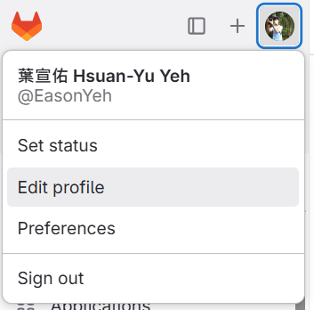
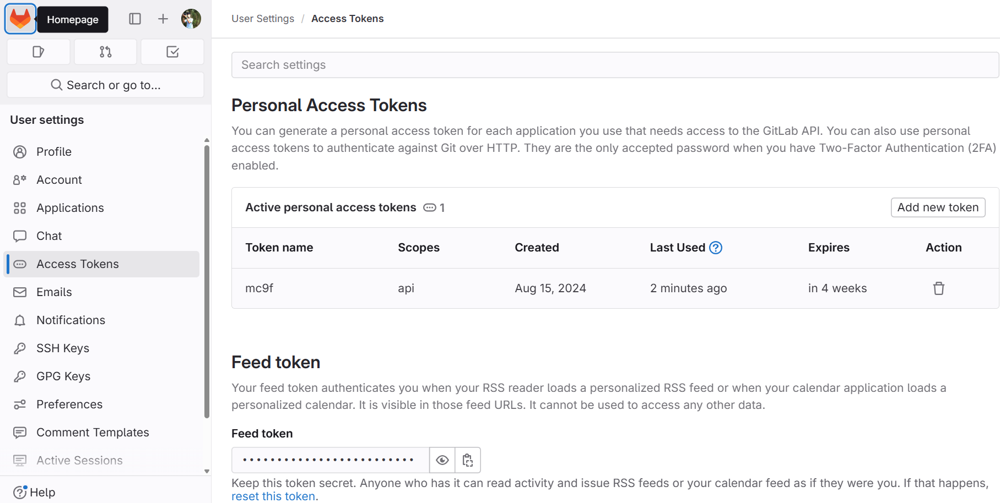
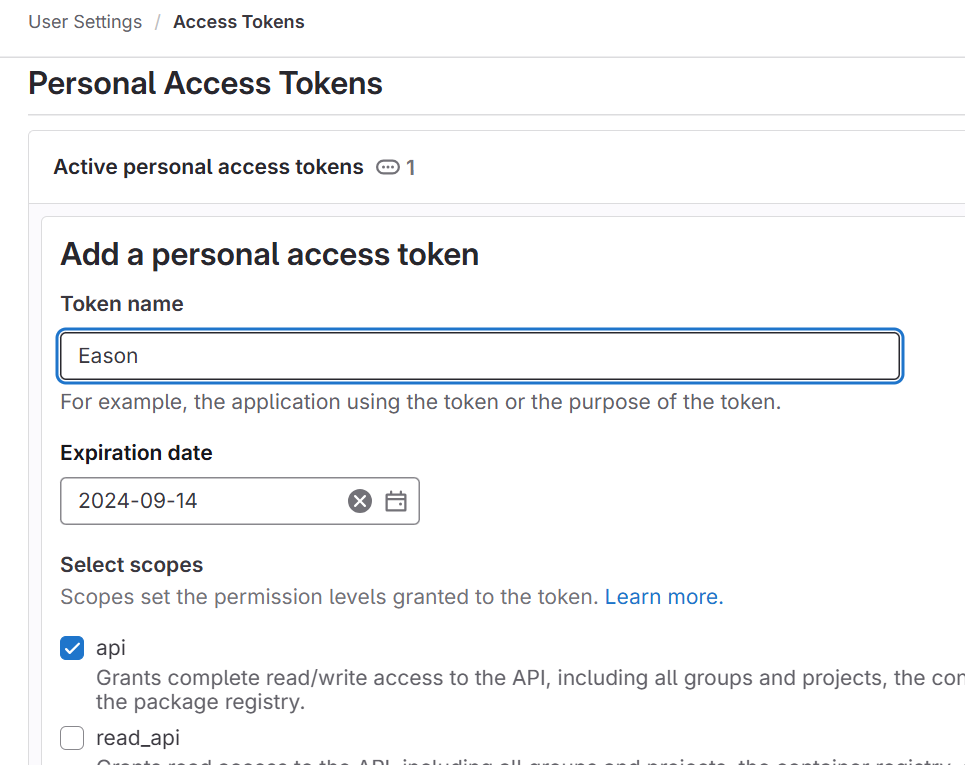
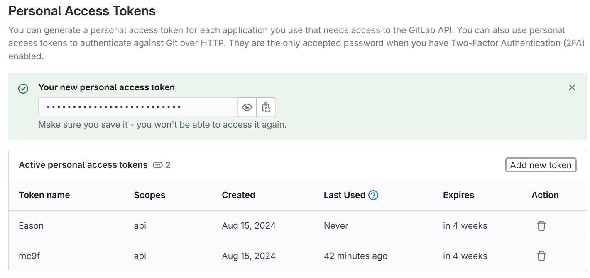

# AISLAB QEMU-SystemC Co-Design Simulator

- Auther - EasonYeh, Yuting
- Version - v1.0.0
- Date - 2024.08.15
---
- Inter process communication
    -  TCP/IP socket
    -  protocol VPIPC (support R/W and IRQ)
- Hardware
    - QEMU - rv64 (virt machine based)
    - SystemC - MMIOBUS
- Software
    - BIOS - OpenSBI
    - OS - Linux 6.0
    - RootFS - buildroot
---
## Quick Start
This section will tell you how to download release zip, boot up virtual platform in Docker quickly and easily, including install systemC library and setup environment.

Use GitLab Personal Access Token
- generate GitLab Personal Access Token, and use it in `wget`。
- click the avatar, selet `Edit profile`\
 \
 

- click `Access Token` on the left
- click `Add new token` \
\

- Enter token name and select `api` (Expiration date is optional)\
\


- click blue button `Create personal access token`
- **Remeber to copy and save the token, it would not show again !!!**\
\


Download Release zip (replace `<your_access_token>` to **your token**)
```sh
$ wget --header="PRIVATE-TOKEN: <your_access_token>"  https://aislab.ee.ncku.edu.tw/EasonYeh/aislabvp/-/archive/v1.0.0/aislabvp-v1.0.0.tar.gz
$ tar -xzf v1.0.0.tar.gz
$ cd aislabvp-v1.0.0
```
Run Docker (will take few minutes)
```sh
$ ./run-docker.sh
```
Install GNU cross-compiler (rv64)
```sh
# In Docker
$ sudo startup get-riscv-gcc
$ sudo startup build-riscv-gcc
```
Install SystemC
```sh
# In Docker
$ sudo /workspace/modules/systemc/systemc.sh
$ module load /workspace/modules/systemc/2.3.3
```
## Boot Up Virtual Platform
aislabvp has its own QEMU virtual machine, including an MMIO device with TCP/IP socket, which can achieve Inter Process Communications.

To co-simulate with both QEMU and SystemC, we need two terminals (using tmux and split to 2 panes)
```sh
# In docker env
$ tmux -s "AISVP"
# press ctrl+B, relese, and then press '%' (shift + 5) : split pane horizontally
# press ctrl+B, relese, and then press right key : select right pane
# press ctrl+B, relese, and then press left key : select left pane
# press ctrl+B, relese, and then press '[' : active scroll mode (press 'q' to exit)
# press ctrl+B, relese, and then press 'd' : detach session
```
If session `AISVP` exists, attach back
```sh
$ tmux a -t "AISVP"
```
Boot up linux on QEMU in first one
```sh
# In docker env (left tmux pane)
$ bash
$ cd /workspace/VPqemu
$ ./run_qemu.sh
```
You will see QEMU waiting for systemC program to connet (halt and wait)
```
[DEBUG] mmio_bus_class_init
[DEBUG] mmio_bus_instance_init
[DEBUG] mmio_bus_realize
[VPIPC] server start at: 127.0.0.1:7000
[AISLAB VP] Waiting systemC to connect \
```
Then, we start SystemC simulation in second terminal
```sh
# In docker env (right tmux pane)
$ cd /workspace/VPsystemC
$ ./demo/test_mmio/main # for example device (Memory)
```
After that, QEMU would keep running and boot up linux successfully, and login with `root`
```sh
[    0.605892] VFS: Mounted root (ext2 filesystem) on device 254:0.
[    0.608744] devtmpfs: mounted
[    0.648522] Freeing unused kernel image (initmem) memory: 2252K
[    0.649304] Run /sbin/init as init process
[    0.817717] EXT4-fs (vda): re-mounted 73d35d8e-2744-4205-b321-28e5d39b345b r/w. Quota mode: disabled.
Seeding 256 bits and crediting
Saving 256 bits of creditable seed for next boot
Starting syslogd: OK
Starting klogd: OK
Running sysctl: OK
Starting network: OK
Starting crond: OK

Welcome to Buildroot
aislabvp login: root  # login with root
(root)root@aislabvp:~#
```
To stop simulation, just turn off the QEMU.
```
(root)root@aislabvp:~# poweroff
```
Then, the IPC between two process will be disconnect
SystemC module can be set to stop automatically or manually.

Another quick method - `tmux.sh`
- We provide `tmux.sh` to simplify the above process.
```
# In docker env (right tmux pane)
$ /workspace/tmux.sh
```

## Software Development (Appilcation and Driver on Linux)
This section will illustrate how to develop software in QEMU.
- To minimize the size of Rootfs, we do not have gcc in QEMU linux, so we need to compile programs outside.
- aislabvp has shared folder between the QEMU (`/mnt/shared`) and docker env (`/workspace/VPqemu/shared`), software developer can build your own progeams in it, then boot up vp as previous section.
- Compile program with gcc - example `helloworld`
```sh
# In docker env
$ cd /workspace/VPqemu/shared/demo/helloworld
$ riscv64-unknown-linux-gnu-gcc ./helloworld.c -o helloworld
```
- Boot up vp and run the program
```
# In QEMU
$ cd /mnt/shared/demo/helloworld
$ ./main
```
- Result will be
```
hello world
```

## Hardware Development (SystemC Hardware Design)
This section will illustrate how to develop hardware using `QEMU_CPU` module.
- `QEMU_CPU` is a systemC TLM 2.0 module with `VPIPC` socket to connent to VP QEMU.
- `QEMU_CPU` support MMIO R/W event passing from QEMU to systemC.
    - using `master_socket`
- `QEMU_CPU` support MMIO R/W and IRQ event passing from systemC to QEMU, which means support DMA for systemC to access QEMU DRAM.
    - using `slave_socket`, not compiled normally.
    - To activate `slave_socket` (be compiled in program), add `-DDMA` when compiling
- No MMU or IOMMU in `QEMU_CPU`, you can design it if you need.

## Hardware Development (VPIPC Protocol)
See [`doc/VPIPC.md`](./doc/VPIPC.md`) for moer information.

## VP Development (Optimize VP IPC etc.)
Clone
```sh
$ git clone https://github.com/EasoncoderTW/aislabvp.git aislabvp
$ cd aislabvp
```
Run Docker
```sh
$ ./run-docker.sh
```
## Startup Usage
In shell, just type `startup` and you can see the help information.
```sh
# In docker env
$ startup
    Welcome to use the AISLAB-platform working environment

    This docker environment is built for the AISLAB-platform development
    All projects are in the /workspace directory
    Here is a list of startup commands that you can run in the docker

    startup [help]                      : show the welcome and usage message
    ----------------    Get    --------------------------------------------------------------
    startup get-qemu [version]          : download qemu source code (default version: 9.0.1)
    startup get-riscv-gcc               : download riscv-gnu-toolchain Cross Compiler
    startup get-opensbi                 : download opensbi source code
    startup get-linux                   : download linux kernel source code
    startup get-buildroot               : download buildroot source code
    startup get-freertos                : download FreeRTOS source code
    ----------------   Build   --------------------------------------------------------------
    startup build-qemu                  : build qemu
    startup build-systemc [version]     : build SystemC library (default version: 2.3.1)
    startup build-riscv-gcc             : build riscv-gnu-toolchain Cross Compiler
    startup build-opensbi               : build opensbi source code
    startup build-linux                 : build linux kernel source code
    startup build-buildroot             : build buildroot source code
    ----------------   Task   --------------------------------------------------------------
    startup init                        : download and build all the above tools with default versions
    startup rebuild-qemu                : rebuild qemu from source code
```
You can download package and build it separately.
```sh
# In docker env
$ startup get-$PACKAGE_NAME
$ startup build-$PACKAGE_NAME
```
Or you can make it all in once:
```sh
# In docker env
$ startup init
```

## Customized
Setup Customized QEMU SOC
```sh
# In docker env
$ cd /workspace/Customized
$ ./setup_aislab_soc.sh
$ startup rebuild-qemu
```
Setup Customized Linux kernal and Root File System
```sh
# In docker env
$ cd /workspace/VPqemu
$ ./setup_qemu.sh # gather files and programs to VPqemu
```


